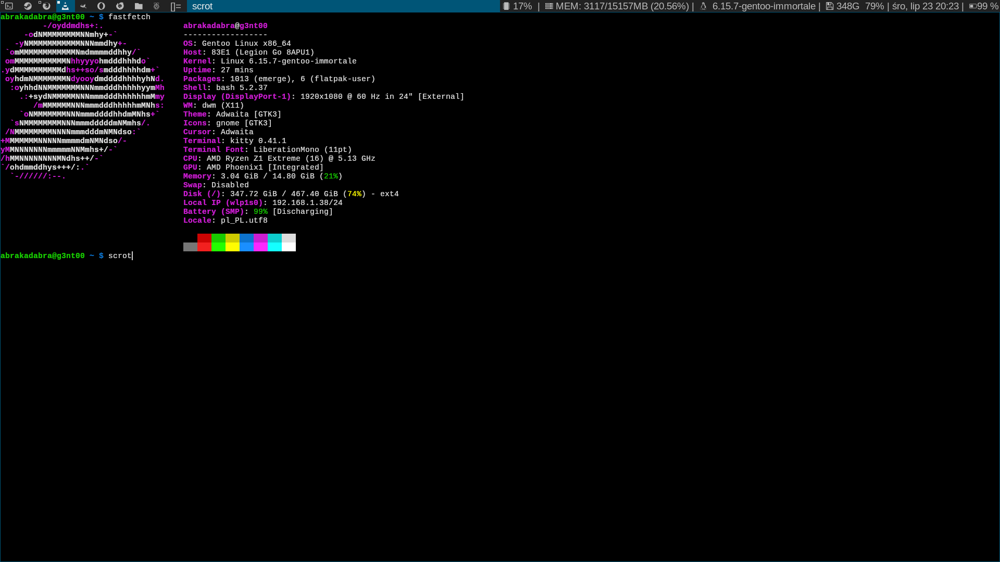

# dwm-immortale
Simple dwm script for X uses on Gentoo Linux.

First read the source code RTSC ;) any question bofh@retro-technology.pl

Instructions:
- unpack dwm-immortale.tar, edit config.h and config.def.h
- change fonts, and whatever you want to use dwm.
- download the file dwmicon separately from the dwm-immortale directory, because I did not put it in the package.
- edit dwmicon for sure this script work on Gentoo Linux, then
- run $mv dwmicon /usr/bin/
- run $doas make clean install

I don't remember if you'll need to install:

Nerd Fonts or Awesome Fonts, but I think so.

Don't forget install rofi or dmenu, terminal like - st,kitty or alacritty.

edit /home/user/.xinitrc via vi,vim or your favourite text editor.

put to file .xinitrc text: 

/usr/bin/dwmicon &

exec dwm 

then save file and run:

$startx

Enjoy.

If you want patches go to official suckless git repo to get patches.

  
